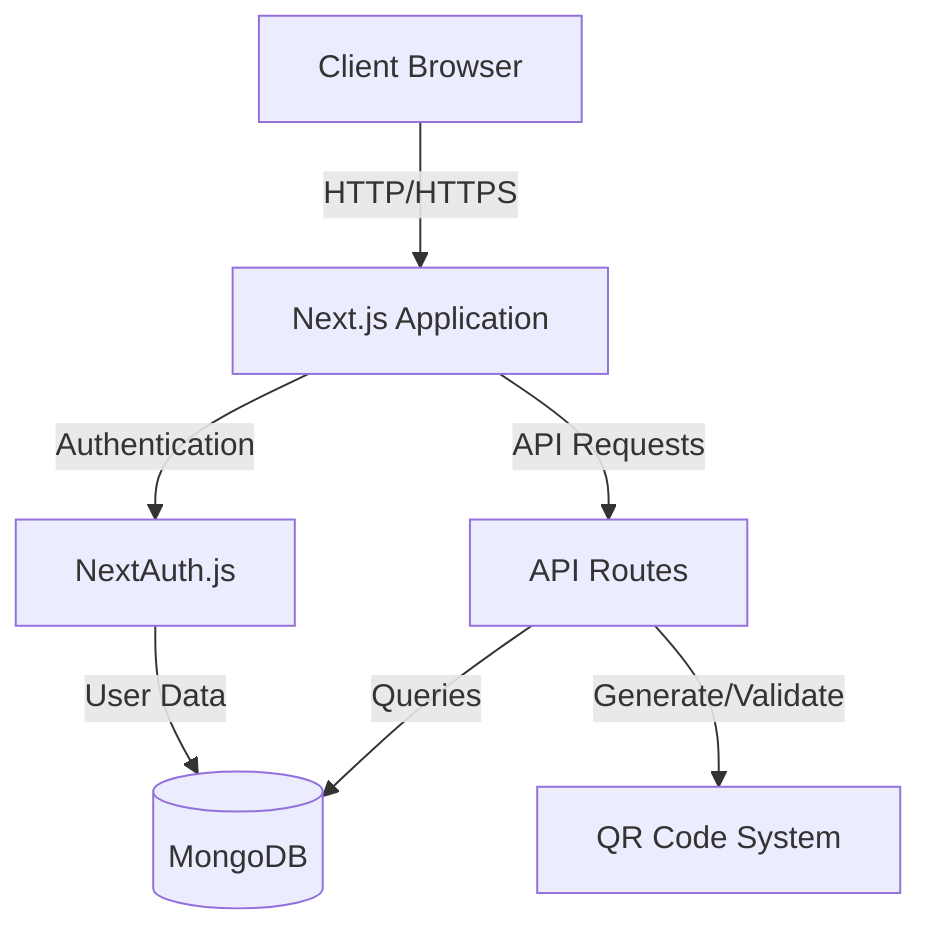
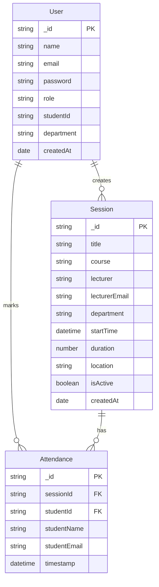
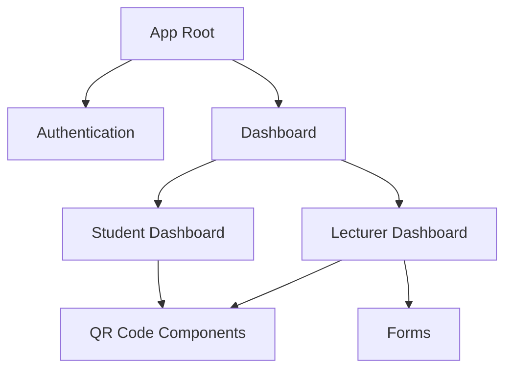
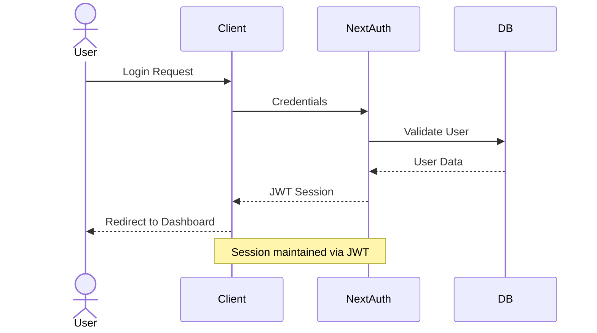
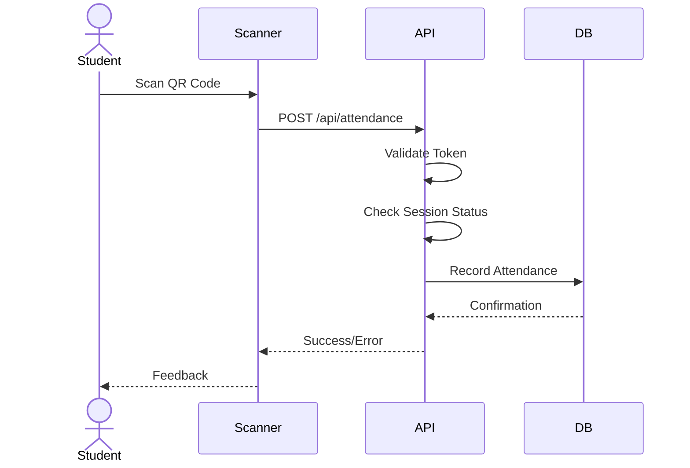

# Technical Architecture

## System Architecture

```mermaid
graph TD
    Client[Client Browser]
    NextJS[Next.js Application]
    Auth[NextAuth.js]
    API[API Routes]
    DB[(MongoDB)]
    QR[QR Code System]

    Client -->|HTTP/HTTPS| NextJS
    NextJS -->|Authentication| Auth
    NextJS -->|API Requests| API
    API -->|Queries| DB
    API -->|Generate/Validate| QR
    Auth -->|User Data| DB
```

## Database Schema

```mermaid
erDiagram
    User ||--o{ Session : "creates"
    User ||--o{ Attendance : "marks"
    Session ||--o{ Attendance : "has"

    User {
        string _id PK
        string name
        string email
        string password
        string role
        string studentId
        string department
        date createdAt
    }

    Session {
        string _id PK
        string title
        string course
        string lecturer
        string lecturerEmail
        string department
        datetime startTime
        number duration
        string location
        boolean isActive
        date createdAt
    }

    Attendance {
        string _id PK
        string sessionId FK
        string studentId FK
        string studentName
        string studentEmail
        datetime timestamp
    }
```

## Component Architecture

```mermaid
graph TD
    App[App Root]
    Auth[Authentication]
    Dashboard[Dashboard]
    Student[Student Dashboard]
    Lecturer[Lecturer Dashboard]
    QR[QR Code Components]
    Forms[Forms]

    App --> Auth
    App --> Dashboard
    Dashboard --> Student
    Dashboard --> Lecturer
    Lecturer --> QR
    Student --> QR
    Lecturer --> Forms
```

## Authentication Flow

```mermaid
sequenceDiagram
    actor User
    participant Client
    participant NextAuth
    participant DB
    
    User->>Client: Login Request
    Client->>NextAuth: Credentials
    NextAuth->>DB: Validate User
    DB-->>NextAuth: User Data
    NextAuth-->>Client: JWT Session
    Client-->>User: Redirect to Dashboard

    Note over Client,NextAuth: Session maintained via JWT
```

## Attendance Marking Flow

```mermaid
sequenceDiagram
    actor Student
    participant Scanner
    participant API
    participant DB
    
    Student->>Scanner: Scan QR Code
    Scanner->>API: POST /api/attendance
    API->>API: Validate Token
    API->>API: Check Session Status
    API->>DB: Record Attendance
    DB-->>API: Confirmation
    API-->>Scanner: Success/Error
    Scanner-->>Student: Feedback
```